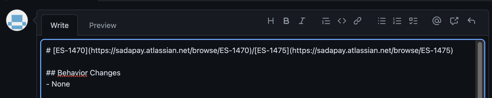

# Comit
## About
Comit (pronounced *"comet"*) is a command-line tool that takes care of the boilerplate in commit messages, branch names, PR titles, and PR headers. The messages, names, and titles follow the standards used by the Engineering team at [SadaPay](https://www.sadapay.pk).
## One Time Setup
Run `comit init` once to setup comit for your team. You will be asked to enter the parent ticket and child ticket numbers. In case you are only working under one ticket, then leave the child ticket blank.

After that, you'll be asked to enter member details where each member needs to be assigned a unique key. The author recommends using their initals as it makes it easier to remember their key. In case two or more of your team members have the same initials, you can add a number as a suffix to clarify, or just use something other than their initials.

Once you're done adding all your members, just enter `0` as the name to finish the initialization wizard. By default, all members are considered "active", which means they'll be added as co-authors in your commit messages unless you set some or all of them as inactive. You'll learn how to do that in the next section, it is easy! 😄

## Day-to-Day Configuration:
You won't be working on the same ticket every single day (hopefully 🤞), nor will you have all your team members available everyday. So, how do you change those little things on a daily basis? It's quite simple, no need to run `comit init` all over again. Just use the following commands at the start of your work.
### Updating parent and child tickets
- Run `comit parent <parentTicket>` to change the parent ticket
- Run `comit child <childTicket>` to change the child ticket
- Run `comit child del` if you need to remove the child ticket
### Updating available members
- Run `comit unset [keys...]` to set some of your team members as inactive
- Run `comit set [keys...]` to set some of your team members as active again
- Optionally, you can pass the `-a` flag to both `set` and `unset` to update the statuses of all your team members at once!
- Note: `[keys...]` are space separated
### Generating commit messages
- Now that you're done setting up Comit for your day, you can simply type `comit` and hit enter to generate a commit message boilerplate and copy it to your clipboard. Paste this message in your IDE's commit message box and modify it as needed.
- In case you also want to add a commit message to the generated boilerplate, just add your message after the command like `comit <commit-message>`. This will still copy the generated string to your keyboard.
- Hmmm, but what if you also want to commit directly from the terminal (like the pros)? 🤔 Well, just pass the `-c` flag with the above command and Comit will directly commit with the generated string rather than copying to your clipboard. Once you get used to the tool, you'll most likely be using this approach the most.
- There are a couple of more things you can do with `comit`, run `comit --help` to see the details.
### Generating branch names
- Since you've already set the parent and child tickets, you can just run `comit branch <description>` to copy the branch name to your clipboard. The `<description>` should be a space-separated one-liner about the branch. For example, if your branch implements a new GET endpoint, you could call `comit branch "get user details"`.

### Generating PR strings
- Run `comit pr title [title-string]` to generate the PR title based on your parent ticket, child ticket, and, if you've passed it, the `[title-string]`.
- Run `comit or header` to generate the PR header like the one you see below:

### Other Stuff You Can Do
- Run `comit show` to see the current config.
- Run `comit reset` to reset the config.
- To add a new member without having to `comit init`, you can use `comit member add` to do just that!
- To remove a member, just run `comit member del <uniqueInitials>`.
- To create a new team out of your existing members in your roster, you can run `comit team new` and follow the instructions provided.
- To set a team as a whole, you can use `comit set team <name>`.
- To delete an existing team, just run `comit team del <name>` where the `<name>` is the case-sensitive name you gave to the team while creating it.

 

***Note:** Always run this tool in a git repo.*